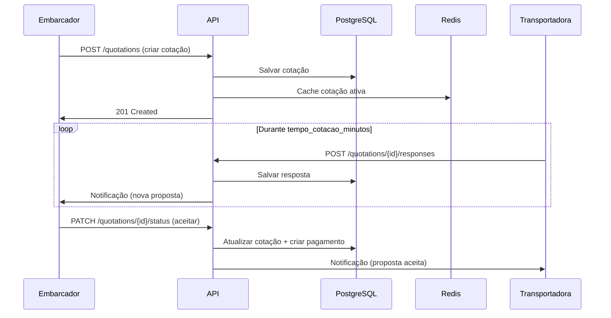

# Visão Geral Técnica - Achei Meu Frete

## Introdução

Este documento fornece uma visão geral da arquitetura técnica, decisões de design e padrões implementados no sistema Achei Meu Frete - uma plataforma para conectar embarcadores e transportadoras.

## Arquitetura do Sistema

### Arquitetura de 3 Camadas

```
┌─────────────────────────────────────────────────────────┐
│                    FRONTEND (Client)                     │
│  Next.js 15 + React 19 + Tailwind CSS + State Mgmt     │
└─────────────────────────────────────────────────────────┘
                           ↕ HTTPS/REST
┌─────────────────────────────────────────────────────────┐
│                   BACKEND (API Server)                   │
│  Fastify/NestJS + JWT Auth + Business Logic             │
└─────────────────────────────────────────────────────────┘
                           ↕
┌──────────────────────┐          ┌────────────────────────┐
│   PostgreSQL         │          │      Redis             │
│  (Dados Principais)  │          │  (Cache + Sessões)     │
└──────────────────────┘          └────────────────────────┘
```

### Componentes Principais

1. **API REST** - Servidor de aplicação com endpoints documentados
2. **Banco de Dados** - PostgreSQL para dados relacionais + Redis para cache
3. **Autenticação** - Sistema JWT com access e refresh tokens
4. **Cache** - Redis para cotações ativas, sessões e rate limiting
5. **Notificações** - Sistema de notificações em tempo real
6. **Pagamentos** - Integração com gateway de pagamento
7. **Storage** - Armazenamento de documentos (CT-e, notas fiscais)

## Fluxos Principais

### 1. Fluxo de Cotação



### 2. Fluxo de Atualização Automática por CT-e

```
1. Transportadora emite CT-e com valor X
2. Sistema compara valor do CT-e com valor acordado
3. Se valores forem diferentes:
   - Sistema atualiza automaticamente o valor da cotação
   - Recalcula taxa da plataforma (5%)
   - Atualiza valor líquido da transportadora
   - Notifica embarcador sobre o ajuste
4. Nenhuma negociação é permitida - ajuste é automático
```

### 3. Sistema de Expiração Automática

```
Cron job (a cada minuto)
    ↓
Busca cotações com expiration_datetime <= NOW()
    ↓
Atualiza status → 'expired'
    ↓
Cotação desaparece de TODAS as telas de transportadoras
    ↓
Notifica embarcador
```

### 4. Fluxo de Avaliações Obrigatórias

```
Cotação completa
    ↓
Sistema marca avaliação como pendente
    ↓
Usuário tenta criar/aceitar nova cotação
    ↓
Sistema verifica avaliações pendentes
    ↓
Se pendente → Bloqueia ação + exibe avaliações pendentes
Se ok → Permite continuar
```

## Stack Tecnológica Recomendada

### Backend
```javascript
{
  "runtime": "Node.js 20 LTS ou Bun 1.0+",
  "framework": "Fastify 4+ (high performance) ou NestJS (enterprise)",
  "language": "TypeScript 5+",
  "orm": "Prisma 5+ (type-safe) ou Drizzle ORM",
  "validation": "Zod (runtime type-safe)",
  "authentication": "jose (JWT) + argon2 (password hashing)",
  "api_documentation": "Scalar ou Swagger (OpenAPI 3.1)",
  "testing": {
    "unit": "Vitest (faster than Jest)",
    "integration": "Supertest",
    "e2e": "Playwright"
  },
  "logging": "Pino (high performance JSON logging)",
  "monitoring": "OpenTelemetry + Grafana + Loki",
  "queue": "BullMQ (Redis-based) for async jobs",
  "websockets": "Socket.io ou WS para notificações real-time",
  "cron": "node-cron ou BullMQ scheduler"
}
```

### Frontend
```javascript
{
  "framework": "Next.js 15+ (App Router) com React 19",
  "language": "TypeScript 5+",
  "styling": {
    "primary": "Tailwind CSS 4+",
    "components": "shadcn/ui (headless, customizable)",
    "icons": "Lucide React"
  },
  "state": {
    "client": "Zustand (lightweight) ou Jotai",
    "server": "TanStack Query v5 (React Query)",
    "forms": "React Hook Form + Zod"
  },
  "http": "Native Fetch API + TanStack Query",
  "realtime": "Socket.io client para notificações",
  "charts": "Recharts ou Chart.js",
  "maps": "Mapbox GL JS ou Leaflet",
  "testing": {
    "unit": "Vitest + React Testing Library",
    "e2e": "Playwright",
    "visual": "Chromatic ou Percy"
  },
  "performance": {
    "images": "Next.js Image Optimization",
    "fonts": "next/font (automatic optimization)",
    "analytics": "Vercel Analytics ou Plausible"
  }
}
```

### Mobile (Opcional)
```javascript
{
  "framework": "React Native com Expo SDK 50+",
  "language": "TypeScript 5+",
  "navigation": "Expo Router (file-based)",
  "state": "Zustand + TanStack Query",
  "ui": "NativeWind (Tailwind for React Native)",
  "notifications": "Expo Notifications + Push",
  "maps": "react-native-maps"
}
```

### Infraestrutura
```yaml
database:
  primary: PostgreSQL 16+ (with pgvector for future ML)
  cache: Redis 7+ (Valkey como alternativa)
  search: Meilisearch ou Typesense (full-text search)
  
payments:
  gateway: InfinitePay API
  boleto: InfinitePay ou Asaas
  
storage:
  files: AWS S3 ou Cloudflare R2
  cdn: Cloudflare CDN
  
deployment:
  containerization: Docker + Docker Compose
  orchestration: Kubernetes (produção) ou Railway/Render (staging)
  ci_cd: GitHub Actions
  hosting: 
    backend: Railway, Render, ou AWS ECS
    frontend: Vercel (Next.js) ou Cloudflare Pages
    database: Supabase, Neon, ou AWS RDS
  
monitoring:
  apm: Better Stack (moderno) ou Sentry
  logs: Better Stack ou Grafana Loki
  metrics: Prometheus + Grafana
  uptime: Better Uptime ou UptimeRobot
  errors: Sentry
  
security:
  waf: Cloudflare WAF
  ddos: Cloudflare DDoS Protection
  ssl: Let's Encrypt (Cloudflare managed)
  secrets: Doppler ou Infisical
```

### DevOps & Tools
```yaml
version_control:
  git: GitHub
  workflow: Trunk-based development
  
code_quality:
  linter: ESLint 9+ (flat config)
  formatter: Prettier 3+
  type_check: TypeScript strict mode
  pre_commit: Husky + lint-staged
  
ci_cd:
  platform: GitHub Actions
  preview: Vercel Preview Deployments
  staging: Automatic deploy on main
  production: Manual approval + blue-green deployment
  
documentation:
  api: Scalar (modern OpenAPI UI)
  code: TSDoc comments
  architecture: Mermaid diagrams
  wiki: GitHub Wiki ou Notion
```

### Pagamentos & Integrações
```yaml
infinitepay:
  api_version: v2
  features:
    - Pagamentos via Pix
    - Cartão de crédito/débito
    - Link de pagamento
    - Boleto (CNPJ autorizado)
    - Split de pagamento (5% plataforma)
  
sefaz:
  cte: API de consulta CT-e
  nfe: Validação de notas fiscais
  
notifications:
  email: Resend (moderno) ou SendGrid
  sms: Twilio
  whatsapp: Twilio WhatsApp Business API
  push: Expo Push Notifications (mobile)
  
maps:
  geocoding: Google Maps API ou Mapbox
  routing: Google Maps Directions API
  tracking: Socket.io para rastreamento real-time
```

## Segurança

### Camadas de Segurança

1. **Autenticação**
   - JWT com access token (15min) e refresh token (7d)
   - Bcrypt para hashing de senhas (cost factor 12)
   - 2FA opcional para contas premium

2. **Autorização**
   - RBAC (Role-Based Access Control)
   - Verificação de ownership em recursos
   - Rate limiting por IP e por usuário

3. **Proteção de Dados**
   - HTTPS obrigatório
   - Helmet.js para headers de segurança
   - CORS configurado com whitelist
   - Input sanitization em todos os endpoints
   - Prepared statements (proteção SQL injection)
   - CSP (Content Security Policy)

4. **Auditoria**
   - Logging de todas operações críticas
   - Tracking de mudanças (quem, quando, o quê)
   - Retenção de logs por 90 dias

### Dados Sensíveis

```javascript
// Nunca armazenar em plain text:
- Senhas (hash com bcrypt)
- Tokens de pagamento (tokenização)
- Dados bancários (criptografia AES-256)
- CPF/CNPJ (hash ou criptografia)

// Variáveis de ambiente (.env):
- Credenciais de banco de dados
- Chaves de API
- Secrets JWT
- Chaves de criptografia
```

## Performance

### Otimizações Implementadas

1. **Database**
   - Índices em colunas de busca frequente
   - Índices compostos para queries complexas
   - Connection pooling (20-100 conexões)
   - Query optimization (evitar N+1)

2. **Caching**
   - Redis para cotações ativas (TTL dinâmico)
   - Cache de sessões de usuário
   - Cache de dados de perfil
   - Invalidação inteligente

3. **API**
   - Paginação em todas listagens
   - Compressão de respostas (gzip)
   - Lazy loading de relacionamentos
   - Rate limiting para prevenir abuso

4. **Frontend**
   - Code splitting
   - Lazy loading de componentes
   - Otimização de imagens
   - Service Workers para cache

### Metas de Performance

| Métrica | Objetivo |
|---------|----------|
| Tempo de resposta API | < 200ms (p95) |
| Tempo de resposta queries DB | < 50ms (p95) |
| Tempo de carregamento página | < 2s (FCP) |
| Uptime | > 99.9% |
| Taxa de erro | < 0.1% |

## Escalabilidade

### Estratégias de Escala

**Horizontal Scaling**
- API stateless (múltiplas instâncias)
- Load balancer (Nginx/ALB)
- Sessões em Redis (compartilhado)

**Database Scaling**
- Read replicas para queries de leitura
- Particionamento de tabelas grandes
- Archive de dados antigos (> 2 anos)

**Caching**
- Multi-layer cache (L1: memory, L2: Redis)
- CDN para assets estáticos
- Edge caching para APIs geográficas

## Monitoramento e Observabilidade

### Métricas Chave

```yaml
application:
  - Requests per second (RPS)
  - Response time (p50, p95, p99)
  - Error rate
  - Active users
  - Cache hit ratio

business:
  - Cotações criadas/hora
  - Taxa de conversão (cotação → aceite)
  - Tempo médio de resposta das transportadoras
  - Valor médio de fretes
  - Taxa de cancelamento

infrastructure:
  - CPU usage
  - Memory usage
  - Database connections
  - Disk I/O
  - Network throughput
```

### Alertas

```javascript
// Alertas críticos (PagerDuty/Slack)
- API down (5xx > 1% por 5min)
- Database connection pool esgotado
- Disco > 85% cheio
- Falha em pagamentos críticos

// Alertas de aviso
- API lenta (p95 > 500ms)
- Taxa de erro aumentada
- Cache hit ratio baixo
- Aumento anormal de tráfego
```

## Testes

### Estratégia de Testes

```
┌─────────────────────────────────────────┐
│  E2E Tests (5%)                         │ ← Cypress
├─────────────────────────────────────────┤
│  Integration Tests (15%)                │ ← Supertest
├─────────────────────────────────────────┤
│  Unit Tests (80%)                       │ ← Jest
└─────────────────────────────────────────┘
```

**Cobertura Mínima**: 80% para código crítico

### Tipos de Teste

1. **Unit Tests** - Funções puras, cálculos, validações
2. **Integration Tests** - Endpoints API, banco de dados
3. **E2E Tests** - Fluxos completos (criar cotação → aceitar → pagar)
4. **Performance Tests** - Load testing com Artillery/K6
5. **Security Tests** - OWASP ZAP, dependency scanning

## CI/CD Pipeline

```yaml
name: CI/CD Pipeline

on: [push, pull_request]

jobs:
  test:
    - Lint (ESLint + Prettier)
    - Type check (TypeScript)
    - Unit tests
    - Integration tests
    - Security scan (npm audit, Snyk)
    
  build:
    - Build Docker image
    - Tag with commit SHA
    - Push to registry
    
  deploy:
    staging:
      - Deploy to staging
      - Run E2E tests
      - Smoke tests
      
    production:
      - Manual approval required
      - Blue-green deployment
      - Health check
      - Rollback automático se falhar
```

## Backup e Disaster Recovery

### Estratégia de Backup

```yaml
postgresql:
  full_backup:
    frequency: daily
    retention: 30 days
    storage: AWS S3
    
  incremental_backup:
    frequency: every 6 hours
    retention: 7 days
    
  wal_archiving:
    enabled: true
    pitr_window: 7 days

redis:
  rdb_snapshot:
    frequency: every 1 hour
    retention: 24 hours
    
  aof:
    enabled: true
    fsync: everysec
```

### RTO/RPO

| Componente | RTO | RPO |
|------------|-----|-----|
| API Server | 5 min | 0 (stateless) |
| PostgreSQL | 15 min | 1 hour |
| Redis | 5 min | 1 hour (aceitável) |

## Conformidade e Regulamentação

### LGPD (Lei Geral de Proteção de Dados)

- Consentimento explícito para coleta de dados
- Direito ao esquecimento (soft delete com anonimização)
- Portabilidade de dados (export JSON/CSV)
- Criptografia de dados sensíveis
- Logs de acesso a dados pessoais
- DPO (Data Protection Officer) designado

### Nota Fiscal Eletrônica

- Integração com API da SEFAZ
- Validação de CT-e (Conhecimento de Transporte Eletrônico)
- Armazenamento seguro de XMLs
- Assinatura digital com certificado A1/A3

## Documentação

### Documentação Técnica Disponível

1. **[API Design](API_DESIGN.md)** - Padrões de API REST, autenticação, validação
2. **[Database Best Practices](DATABASE.md)** - Otimização, índices, transações
3. **[Database Schema](DATABASE_SCHEMA.md)** - Schema completo com todas as tabelas
4. **[Business Rules](BUSINESS_RULES.md)** - Regras de negócio críticas
5. **[Project Structure](../PROJECT_STRUCTURE.md)** - Organização do código

### Documentação Adicional Necessária

- [ ] Guia de instalação e setup local
- [ ] Documentação de API (Swagger/OpenAPI)
- [ ] Runbook operacional
- [ ] Guia de contribuição para desenvolvedores
- [ ] Troubleshooting guide
- [ ] Architecture Decision Records (ADRs)

## Roadmap Técnico

### Fase 1 - MVP (3 meses)
- [x] Documentação técnica e regras de negócio
- [ ] Setup do projeto e infraestrutura
- [ ] Autenticação e perfis
- [ ] CRUD de cotações
- [ ] Sistema de respostas
- [ ] Pagamentos básicos

### Fase 2 - Core Features (3 meses)
- [ ] Negociação de CT-e
- [ ] Sistema de bloqueio por atrasos
- [ ] Notificações em tempo real
- [ ] Sistema de avaliações
- [ ] Dashboard para embarcadores
- [ ] Dashboard para transportadoras

### Fase 3 - Advanced Features (3 meses)
- [ ] Integração com gateway de pagamento
- [ ] Sistema de cashback
- [ ] Planos premium
- [ ] Integração com SEFAZ (CT-e)
- [ ] Rastreamento de cargas
- [ ] Analytics avançado

### Fase 4 - Scale & Optimization (Contínuo)
- [ ] Otimização de performance
- [ ] Implementação de cache avançado
- [ ] Read replicas
- [ ] CDN para assets
- [ ] Auto-scaling
- [ ] Disaster recovery testing

---

**Última atualização**: 2026-01-26  
**Versão**: 1.0.0  
**Mantenedor**: Equipe Achei Meu Frete
